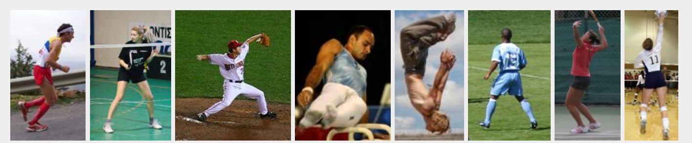
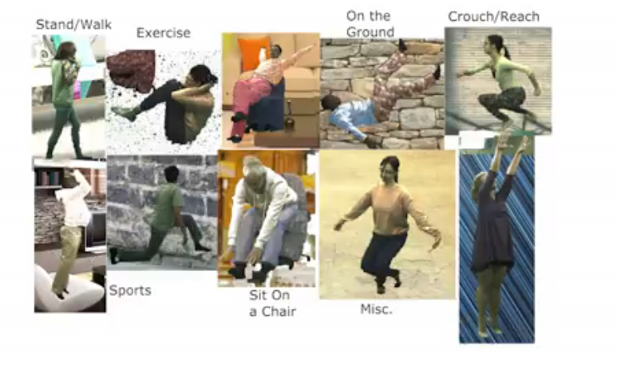
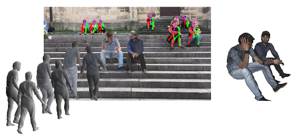

# HumanPoseMemo
Memo about 3D human pose estimation, record of datasets, papers, codes.

## Datasets

### [2D datasets](./datasets/2d.md)

  
<b>related works</b>

  

    
  

  

  - [Leeds Sports Pose Dataset](http://sam.johnson.io/research/lsp.html)
  - [Leeds Sports Pose Extended Training Dataset](http://sam.johnson.io/research/lspet.html)
  - [coco](http://cocodataset.org/#home)
  - [MPII Human Pose Dataset](http://human-pose.mpi-inf.mpg.de/)
  - [lsp-mpii-ordinal](https://www.seas.upenn.edu/~pavlakos/projects/ordinal/)
  - [AI challenger keypoint dataset](https://challenger.ai/dataset/keypoint)
  

### [3D datasets](./datasets/3d.md)

  
<b>related works</b>

  

    
  

  

  - [Human3.6M](http://vision.imar.ro/human3.6m/description.php)
  - [Unit the People](http://files.is.tuebingen.mpg.de/classner/up/)
  - [mpi_inf_3dhp](http://gvv.mpi-inf.mpg.de/3dhp-dataset)
  - [CMU Panoptic Dataset](http://domedb.perception.cs.cmu.edu/)
  

### [SMPL datasets](./datasets/smpl.md)

  
<b>related works</b>

  

    
  

  

  - [SURREAL](http://www.di.ens.fr/willow/research/surreal/)
  

### [Dressed datasets](./data[点击跳转](#jump)sets/dress.md)

  
<b>related works</b>

  

    
  

  

  - [3DPeople: Modeling the Geometry of
        Dressed Humans](https://www.albertpumarola.com/research/3DPeople/index.html)
  

### Face, Hands and Feet

  
<b>related works</b>

  

    
  - [FreiHAND: A Dataset for Markerless Capture of Hand Pose and Shape fromSingle RGB Images](https://lmb.informatik.uni-freiburg.de/projects/freihand/)
  

## Papers
> note: I don't include some paper without codes.

### Monocular human pose estimation

  
<b>2020</b>

  

  - [Compressed Volumetric Heatmaps for Multi-Person 3D Pose Estimation](https://arxiv.org/abs/2004.00329):[[code](https://github.com/fabbrimatteo/LoCO)]
  - [Learning 3D Human Shape and Pose fromDense Body Parts](https://arxiv.org/pdf/1912.13344.pdf)
  - [CVPR 20, Monocular Real-time Hand Shape and Motion Capture using Multi-modal Data](https://calciferzh.github.io/publications/zhou2020monocular):[[code](https://github.com/CalciferZh/minimal-hand)]
  - [CVPR 20, Hierarchical Human Parsing with Typed Part-Relation Reasoning](https://github.com/hlzhu09/Hierarchical-Human-Parsing):[[code](https://github.com/hlzhu09/Hierarchical-Human-Parsing)]
  - [CVPR 20, VIBE: Video Inference for Human Body Pose and Shape Estimation](https://github.com/mkocabas/VIBE)]
  

  
<b>2019</b>

  

  - [CVPR, 19. Learning 3D Human Dynamics from Video](https://github.com/akanazawa/human_dynamics)
  - [ICCV, 19. TexturePose: Supervising Human Mesh Estimation with Texture Consistency](https://github.com/geopavlakos/TexturePose)
  - [ICCV, 19. SPIN - SMPL oPtimization IN the loop](https://github.com/nkolot/SPIN)
  - [ICCV, 19. Delving Deep Into Hybrid Annotations for 3D Human Recovery in the Wild](https://github.com/penincillin/DCT_ICCV-2019)
  - [ICCV, 19. Camera Distance-aware Top-down Approach for 3D Multi-person Pose Estimation from a Single RGB Image](https://github.com/mks0601/3DMPPE_ROOTNET_RELEASE)
  - [CVPR, 19. Exploiting temporal context for 3D human pose estimation in the wild](https://github.com/deepmind/Temporal-3D-Pose-Kinetics)
  - [CVPR, 19. Learning Joint Reconstruction of Hands and Manipulated Objects - Demo, Training Code and Models](https://github.com/hassony2/obman_train)
  - [ICCV, 19. MonoLoco: Monocular 3D Pedestrian Localization and Uncertainty Estimation](https://github.com/vita-epfl/monoloco)
  - [SIGGRAPH Asia, 18. Motion Reconstruction Code and Data for Skills from Videos (SFV)](https://github.com/akanazawa/motion_reconstruction)
  - [CVPR, 19. Monocular Total Capture: Posing Face, Body and Hands in the Wild](https://github.com/CMU-Perceptual-Computing-Lab/MonocularTotalCapture)
  - [CVPR, 19. Detailed Human Shape Estimation from a Single Image by Hierarchical Mesh Deformation](https://github.com/zhuhao-nju/hmd)
  - [CVPR, 19. Convolutional Mesh Regression for Single-Image Human Shape Reconstruction](https://github.com/nkolot/GraphCMR)
  - [CVPR, 19. Self-Supervised Learning of 3D Human Pose using Multi-view Geometry](https://github.com/mkocabas/EpipolarPose)
  - [CVPR, 19. 3D human pose estimation in video with temporal convolutions and semi-supervised training](https://github.com/facebookresearch/VideoPose3D)
  

  
<b>2018</b>

  

  - [ECCV, 18. Integral Human Pose Regression](https://github.com/JimmySuen/integral-human-pose)
  - [CVPR, 18. End-to-end Recovery of Human Shape and Pose](https://github.com/akanazawa/hmr)
  - [CVPR, 18. Ordinal Depth Supervision for 3D Human Pose Estimation](https://github.com/geopavlakos/ordinal-pose3d)
  

### Multi-view human pose estimation

  
<b>2020</b>

  

  

  
<b>2019</b>

  

  - [ICCV, 19. Cross View Fusion for 3D Human Pose Estimation](https://github.com/microsoft/multiview-human-pose-estimation-pytorch)
  - [ICCV, 19. Shape-Aware Human Pose and Shape Reconstruction Using Multi-View Images](https://github.com/williamljb/HumanMultiView)
  - [ICCV, 19 Learnable Triangulation of Human Pose](https://github.com/karfly/learnable-triangulation-pytorch)
  - [CVPR, 19. Fast and Robust Multi-Person 3D Pose Estimation from Multiple Views](https://github.com/zju3dv/mvpose)

  

  
<b>2018</b>

  

  - [CVPR, 17. Coarse-to-Fine Volumetric Prediction for Single-Image 3D Human Pose](https://github.com/geopavlakos/c2f-vol-train)
  - [3DV, 17. Towards Accurate Marker-less Human Shape and Pose Estimation over Time](https://github.com/YinghaoHuang91/MuVS)
  

### Detailed human shape reconstruction

  
<b>2020</b>

  

  - [PIFuHD: Multi-Level Pixel-Aligned Implicit Function for High-Resolution 3D Human Digitization](https://shunsukesaito.github.io/PIFuHD/):[[code](https://github.com/shunsukesaito/PIFuHD)]
  

  
<b>2019</b>

  

  - [ICCV 19, PIFu: Pixel-Aligned Implicit Function for High-Resolution Clothed Human Digitization](https://shunsukesaito.github.io/PIFu/):[[code](https://github.com/shunsukesaito/PIFu)]
  - [Learning Nonparametric Human Mesh Reconstruction from a Single Image without Ground Truth Meshes](https://arxiv.org/pdf/2003.00052.pdf)：image  => 2D pose + part seg ==Graph-CNN==> mesh
  - [PeelNet: Textured 3D reconstruction of human body using single view RGB image](https://arxiv.org/pdf/2002.06664.pdf)
  - [CVPR, 19. Dense Intrinsic Appearance Flow for Human Pose Transfer](https://github.com/ly015/intrinsic_flow)
  - [ICCV, 19. Liquid Warping GAN: A Unified Framework for Human Motion Imitation, Appearance Transfer and Novel View Synthesis](https://github.com/svip-lab/impersonator)
  - [CVPR, 19. Learning to Regress 3D Face Shape and Expression from an Image without 3D Supervision](https://github.com/soubhiksanyal/RingNet)
  - [ICCV, 19. Multi-Garment Net: Learning to Dress 3D People from Images](https://github.com/bharat-b7/MultiGarmentNetwork)
  

  
<b>2018</b>

  

  - [3DV, 18. Detailed Human Avatars from Monocular Video.](https://github.com/thmoa/semantic_human_texture_stitching)
  - [CVPR, 18.  Learning to Reconstruct People in Clothing from a Single RGB Camera.](https://github.com/thmoa/octopus)
  - [CVPR, 18. Video based reconstruction of 3D people models.](https://github.com/thmoa/videoavatars)

  

## Multi-View Stereo

  
<b>2020</b>

  

  - [NeRF: Representing Scenes as Neural Radiance Fields for View Synthesis](http://www.matthewtancik.com/nerf): [[code](https://github.com/bmild/nerf)],[[code-PyTorch](https://github.com/yenchenlin/nerf-pytorch)]
  

  
<b>2019</b>

  

  - [DeepPruner: Learning Efficient Stereo Matching via Differentiable PatchMatch](https://arxiv.org/pdf/1909.05845.pdf): [[code](https://github.com/uber-research/DeepPruner)]
  

### Other

  
<b>2020</b>

  

    
  - [Learning Character-Agnostic Motion for Motion Retargeting in 2D](https://motionretargeting2d.github.io/)
    Decompose and recompose the video, could be used for motion retrival.
  

  
<b>2019</b>

  

  - [CVPR, 19. SMPL-X: A new joint 3D model of the human body, face and hands together](https://github.com/vchoutas/smplx)
  - [CVPR, 17. Learning from Synthetic Humans (SURREAL)](https://github.com/gulvarol/surreal)
  - [BMVC, 18. Learning Human Optical Flow](https://github.com/anuragranj/humanflow)
  - [ICCV, 19. Resolving 3D Human Pose Ambiguities with 3D Scene Constraints](https://github.com/MohameHassan/prox)
  

  
<b>2018</b>

  

  

## Resources

  
<b>Other</b>

  

  
  - [Mixamo](https://www.mixamo.com/#/)
  

## Contribute
You can contribute to this repor by fork and pull.

You can also see [Awesome Human Pose Estimation](https://github.com/cbsudux/awesome-human-pose-estimation), [awesome-3d-human](https://github.com/lijiaman/awesome-3d-human)
