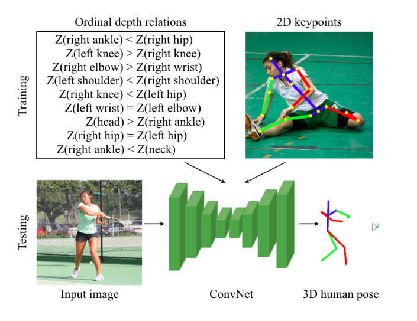
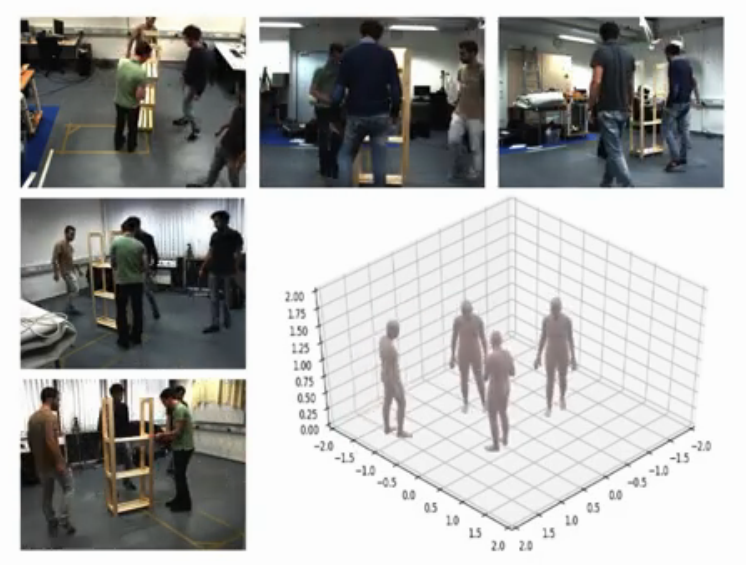

# HumanPoseMemo
Memo about 3D human pose estimation, record of datasets, papers, codes.

## Datasets

### [2D datasets](./datasets/2d.md) 

### [3D datasets](./datasets/3d.md)

### [SMPL datasets](./datasets/smpl.md) 

## Papers
- [Monocular human pose estimation](./paper/mono.md)

- [Multi-view human pose estimation](./paper/multi.md)

- [Other](./paper/other.md)

## Codes

[Resolving 3D Human Pose Ambiguities with 3D Scene Constraints](https://github.com/MohameHassan/prox)
