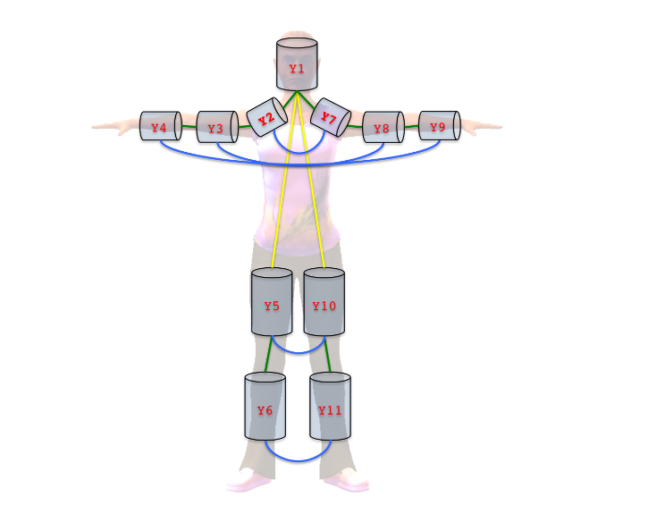
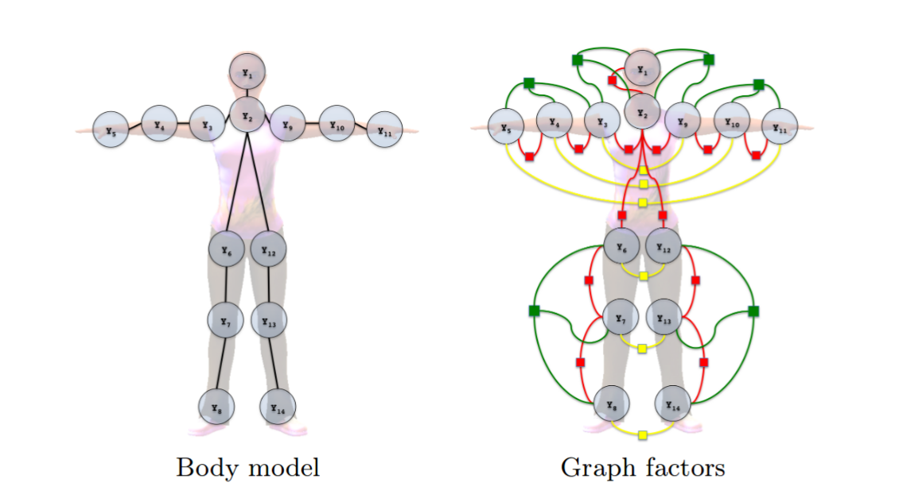
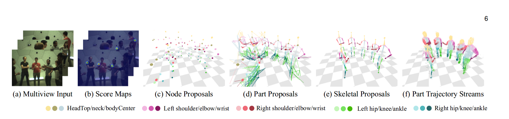
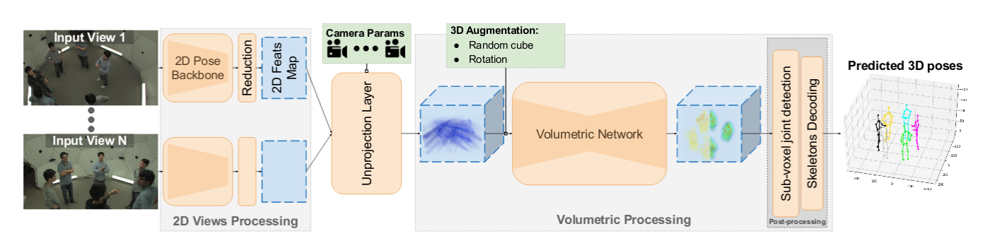
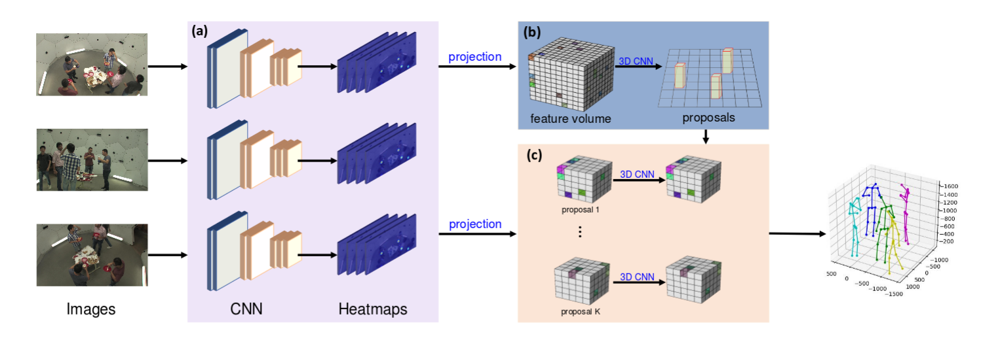

# 多视角多人重建方法

**问题介绍：**

**输入：**多个相机（通常已经标定）下的图片（或视频），每张图片上有多个人

**输出：**多个人体的三维姿态

### 发展顺序：

[3D Pictorial Structures for Multiple Human Pose Estimation](http://campar.in.tum.de/pub/belagiannis2014cvpr/belagiannis2014cvpr.pdf)

使用3D图结构，对骨架建模。定义了离散的状态空间，在离散的状态空间上找最大后验。

- 使用3D pictorial structure，对part的位置进行建模
- 定义离散状态空间，使用2D上检测出来的part进行三角化，得到在3D上的可能的候选part
- 定义unary potentials:  重投影误差；可见性；part长度；
- 定义pairwise potentials: 定义旋转、位移的正则项；对称位置的part的碰撞检测，使用球的距离近似。

[**ECCV14: **Multiple Human Pose Estimation withTemporally Consistent 3D Pictorial Structures](http://campar.in.tum.de/pub/belagiannis2014eccvChalearn/belagiannis2014eccvChalearn.pdf)

[**ICCV15: ** Panoptic Studio: A Massively Multiview Systemfor Social Interaction Capture](https://arxiv.org/pdf/1612.03153.pdf)

- 从图像中获取2D关节的score map，反投影到3D voxel中，得到3D score map。

- R-CNN + CPM, 使用max操作合并到一张图里
- **3D Node Proposal**： 使用spatial voting method获得3D score map <- 4cm voxel grid。投影每个格子到所有视角，取2D score的平均。通过阈值筛选。
- **3D Part Proposals： ** 对3D可能的node投影到2D，计算connectivity score
- **Skeletal Proposals： ** 使用DP连接出人，然后将其移除，再不断连人。获得对应关系之后，重新计算，可以提高精度。时序上，通过窗口，寻找head节点。

motion cues from a 3D patch trajectory stream

问题：只能观测到表面的运动，而不能观测到隐藏的骨架的运动

**论文分类：**

- top-down
- bottom-up
- end-to-end

MVPOSE的改进方向：

1. 单帧的方法改成track的
2. 增加相机数目
3. 增加场景中的人数
4. 提高速度

MVPOSE的应用方向：

1. 制作3D数据集

存在问题：

1. 

[Synergetic Reconstruction from 2D Pose and 3D Motionfor Wide-Space Multi-Person Video Motion Capture in the Wild](https://arxiv.org/pdf/2001.05613.pdf)

[Multi-View Matching (MVM): Facilitating Multi-Person 3D Pose Estimation Learning with Action-Frozen People Video](https://arxiv.org/pdf/2004.05275.pdf)

[**CVPR20:** Cross-View Tracking for Multi-Human 3D Pose Estimation at over 100 FPS](http://openaccess.thecvf.com/content_CVPR_2020/html/Chen_Cross-View_Tracking_for_Multi-Human_3D_Pose_Estimation_at_Over_100_CVPR_2020_paper.html)

[Light3DPose: Real-time Multi-Person 3D PoseEstimation from Multiple Views](https://arxiv.org/pdf/2004.02688.pdf)

- 从图像获得2D Feats Map.
- 使用反投影操作，获得3D volume
- 通过volumetric network，进行sub-voxel detection

[**ECCV20: **End-to-End Estimation of Multi-Person 3DPoses from Multiple Cameras](https://arxiv.org/pdf/2004.06239.pdf)

[**ECCV20: **VoxelPose: Towards Multi-Camera 3D HumanPose Estimation in Wild Environment](https://arxiv.org/pdf/2004.06239.pdf)

- 对输入图片，通过网络计算关节点Heatmaps
- 对每个视角下的heatmaps，构造feature volume
- 使用Cuboid Proposal Network对人体进行定位
- 使用Pose Regression Network对人体姿态进行估计

| paper                  | SHELF PCP | Speed         | Other |
| ---------------------- | --------- | ------------- | ----- |
| Belagiannis, CVPR14    | 71.3      | 1fps,         |       |
| Belagiannis, ECCV14    | 76        |               |       |
|                        |           |               |       |
| mvpose, CVPR19         | 96.9      | 0.465s        |       |
|                        |           |               |       |
| 100fps, CVPR20         | 96.9      | 325fps(shelf) |       |
| 4D Association, CVPR20 | **97.6**  | 30fps(真实时) |       |
| Light3DPose            | 89.8      | 0.146s        |       |
| VoxelPose, ECCV20      | 97.0      | 0.3s          |       |

==> 已经无法再继续刷点了

1. 提出新的指标
2. 提出新的数据集

整个问题的改进方向：

从人与相机数量方向

- 人少相机多
- 人多相机少：许多人只有一个视角可见 <= 结合单目估计方法
- 人多相机多

从相机来考虑

- 相机不固定
- 相机未标定

从时序来考虑

- 如何结合时序信息
- 多人动作预测

应用方向：

1. 

http://domedb.perception.cs.cmu.edu/tutorials/cvpr17/

http://domedb.perception.cs.cmu.edu/tutorials/cvpr17/slides/session3_byHanTomas.pdf

https://arxiv.org/pdf/2007.14878.pdf

http://papers.nips.cc/paper/8646-domes-to-drones-self-supervised-active-triangulation-for-3d-human-pose-reconstruction.pdf