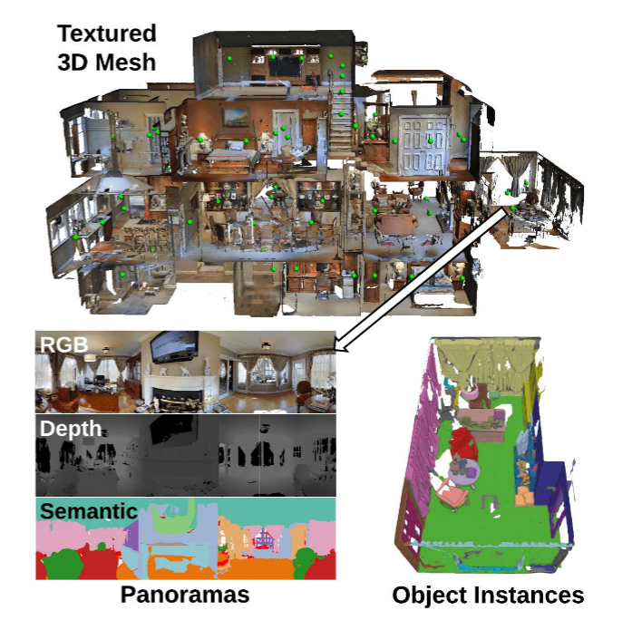
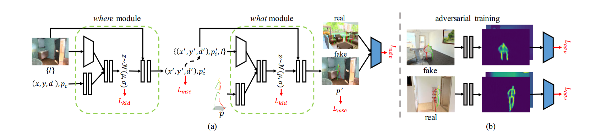

# Generating 3D People in Scenes without People

**问题背景：** 给定一个没有人的场景，人类可以想象人在这个场景中可以怎样与环境、物体进行交互。

**输入：** 一个无人的场景

**输出：** 该场景下人体的合理的、自然的姿态

**难点：** 

1. 语义的角度来看要合理。例如人坐在沙发上，人在炉子边烹饪
2. 物理的角度来看要合理。例如人与环境不会交叉，并且还能有一些物理上的接触的交互。

**应用：** 合成训练数据，用于人体姿态估计

## 问题背景

近年来，有许多工作提出了许多高质量的3D室内场景数据集。这些数据集通常使用的是3D扫描和重建技术来制作的。这些数据集通常用于场景理解等任务。但是，这些数据集的一个比较大的局限就是，场景里面是没有人的。一方面是无法自动的生成合理的人的姿态，另一方面是因为如果人工标注的话比较麻烦。因此，本文的目标就是自动的生成自然的且合理的场景中的人。

- 物理上合理的：没有浮动与交叉
- 多样性的
- 姿态自然

一方面可以用于生成带有人体的室内场景数据集，另一方面也可以合成人体数据。

**解法：**人是如何进行推理的。通常是根据物体的结构与语义信息。

1. 使用CVAE框架。输入：场景深度与语义信息，输出：从CVAE中采样的人体
2. 优化人体交互，消除物理上不可能的情况。
3. 人体模型表示：使用参数化的有细节的人体模型表示SMPL-X。

**训练数据：**使用了之前的论文提出的PROX-Qualitative数据集。

**扩展数据：**增加许多虚拟的相机，从而渲染出图片、场景深度、语义分割

**测试：**使用Matterport3D数据集

**评价指标：**物理合理性、语义合理性。

## 方法

**三维场景表示：** 

- 使用单个视角下的深度与语义进行表示；不使用多视角的图像；
- 视角选择：使用Habitat simulator获得视角

**三维人体表示：**

- 使用SMPL-X人体模型

**几何优化：**与之前类似

### 损失函数

**KL散度：** 监督VAE

**VPoser loss： ** 人体姿态先验

**Collision loss: ** 限制碰撞

**Contact loss: ** 鼓励接触

## 实验

#### 数据集

**PROX-E：** 扩展前一篇论文中的PROX-Q数据集，作为pseudo-gt。

1. 手动增加了一些墙、地面和天花板，使得原有的扫描结果闭合
2. 手动标注了场景的语义信息
3. 降采样了视频，在每一帧增加了许多虚拟的相机，相机指向人体。获得了70K帧。

**MP3D-Ｒ:** 从Ｍatterport3D中取出７个不同的房间。使用Habitat simulator进行截图。同样计算深度与语义、场景的SDF。

#### 场景感知的人体网格生成

**baseline：**现有的方法生成的只有骨架，因此做了一些修改

- 将场景的表达从RGB改为了depth+semantics
- 训练过程中使用了K-means的聚类结果作为类别
- `what`模块修改为输出SMPL-X参数
- 将投影人体骨架改为投影人体mesh

**Diversity指标：** 评价生成的人体的分布的多样性。

首先使用K-means算法对SMPL-X参数聚到20类，然后计算熵(entropy)。熵的值越高说明分布越广。

**物理指标：** 计算人体与场景的碰撞与接触情况。输入场景的SDF与SMPL-X的mesh。

- 非碰撞项：SDF值为正的点的比例
- 接触项：生成的所有人体中，与场景有接触的比例

**User study：** 上传数据到AMT，找人评分。1分表示不自然，5分表示很自然。

#### 场景感知的3D人体姿态估计

**目的：** 证明模型能够提高单视角图片中的3D人体姿态估计能力

**方法：** 

- RGB图片 ==>  使用预训练模型获得：深度图 + 语义分割
- 将深度图+语义分割输入模型，采样生成100个人体
- 使用AlphaPose获取2D关节点
- 使用背景图片获得平均姿势
- 优化使用平均姿势初始化，优化过程中使用平均姿势作为先验项
- 使用与之前的同样的方法进行优化

**结论：** 将该模型作为一个scene-dependent姿态先验，能够提高姿态估计效果。

## 总结

1. 提出了从场景输出3D人体的方法
2. 扩展了两个数据集，提出了三个指标
3. 证明人体与场景的先验能够提高单张图片中的三维人体姿态估计

## 相关文章

[利用3D场景约束解决3D人体姿态模糊性](https://zhuanlan.zhihu.com/p/97631691)

[Habitat: A Platform for Embodied AI Research.](https://arxiv.org/pdf/1904.01201.pdf)

[Matterport3D: Learning from RGB-D Data in Indoor Environments](https://arxiv.org/pdf/1709.06158.pdf)

[On the continuity of rotation representations in neural
networks.](https://arxiv.org/pdf/1812.07035.pdf)

[Putting Humans in a Scene: Learning Affordance in 3D Indoor Environments](https://arxiv.org/pdf/1903.05690.pdf)

图片源自以上论文中。