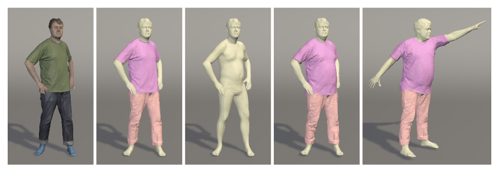
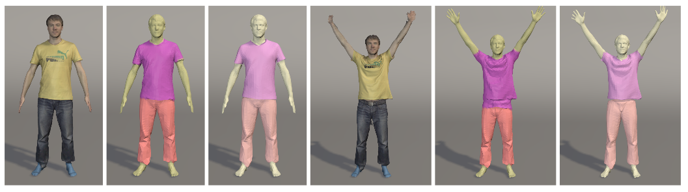
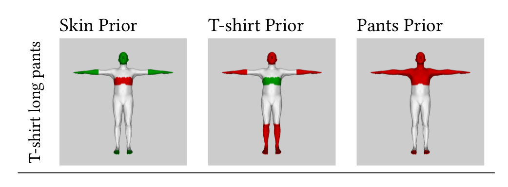
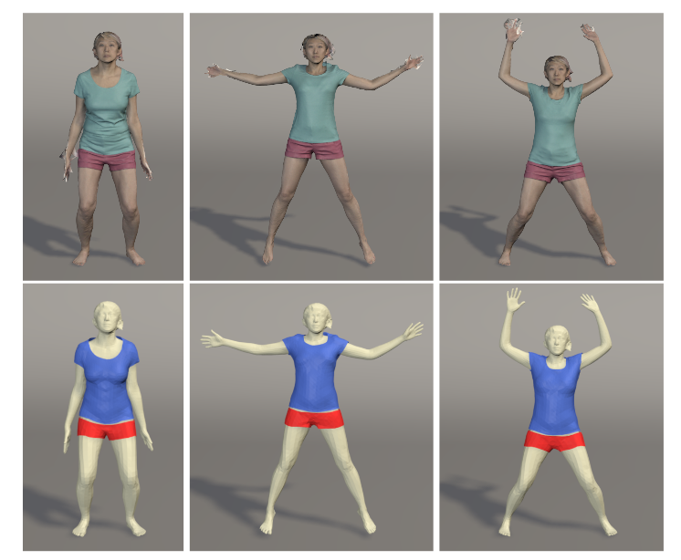

# ClothCap：无缝的4D衣服捕捉与重定向

> 论文地址：[Siggraph, 2017] [ClothCap: Seamless 4D Clothing Capture and Retargeting](https://ps.is.tuebingen.mpg.de/publications/pons-moll-siggraph2017)  
>
> [视频地址](https://www.youtube.com/watch?v=dVxj8tzx04U) 

## 总览

 从左至右：1. 输入的有纹理的体3D点云数据; 2. 使用MRF自动分割衣服; 3.估计minimally clothed shape;4.5. 可以修改人体的shape和pose，衣服也会随之改变

- **目标**：衣服捕捉、建模、重定向、变姿势、虚拟换装

- **问题**：如何对人体衣服与人体同时进行建模
- **输入**：4D扫描数据
- **输出**：人体动作、形状；衣服
- **挑战**：高质量的捕捉、分割、表面跟踪、人体形状动作估计
- **方法**：使用多网格(multi-mesh)表达。
- **贡献**：
  - 一种利用人体模型自动分割扫描数据的方法
  - 一种多网格模板跟踪方法
  - 一种重定向衣服到新的形状的方法
- **数据**：60fps的高精度的4D scan
- **步骤**：
  0. 设置：定义衣服的数量，以及这些衣服大概会在身体的什么部位
  1. 分割：
     - 输入：4D扫描数据（点）
     - 输出：每一帧的SMPL对齐的结果
     - 输入：SMPL对齐结果与扫描数据
     - 输出：每一帧上每一个点的分割结果
  2. Multi-cloth alignment: 变形分割的衣服模型去拟合分割的扫描数据
  3. 重定向：根据输入的序列估计衣服是怎样根据shape变形的，并简单的应用到新的序列上

详细介绍：

## 身体模型

基于SMPL模型，可参考之前写的[SMPL模型介绍](假的链接)

**输入**：$\beta, \theta$ 表示人体形状与姿势

**输出**：$T$表示人体网格模型所有点的坐标

## 衣服捕捉

### 5.1 单网格模型配准

**输入：** 3D扫描数据

**输出：** 对每一帧的对齐的SMPL模型

这件事情分成两步进行：

第一步：拟合第一帧

**输入：** 每一段视频的第一帧的扫描数据，A-pose

**输出：** 变形过的每一段视频的SMPL模型，作为后面其他帧的模板

定义能量函数，最小化。各项为：

- 数据项：使SMPL变形模型上的点与扫描的点云接近
- 耦合项：使变形的模型与未变形的SMPL模型接近，约束变形的程度
- 姿态先验：接近A-pose
- 形状先验：约束SMPL的形状参数

第一点五步：计算无pose的衣服模板

**输入：** 上一步解出的有姿势的模板

**输出：** 无姿势的模板

同样求解优化问题

求解出一个根据此时的pose参数变形之后与当前姿势的模板接近的模板。这个模板可以与SMPL相同的方式根据pose进行变换

第二步，对于每一段视频：

**输入：** 上一步求出的模板

**输出：** 将模板对齐到后续各帧的结果

解优化问题：

- 数据项：将新的有衣服的模板根据每帧的动作变形之后与扫描的点云尽量接近
- 修正的耦合项：有衣服的模型与这一帧的变形模型尽量接近

### 5.2 身体模型辅助下的衣服分割

**输入：** 带衣服的模板

**输出：** 模板上每一个点的类别，属于人的皮肤或者某一类衣服。

**问题：** 噪音、阴影、光照变化

代价函数：

- 数据相似项：
  

  对于第i个点，j是其邻域上的点，使用混合高斯模型(GMM)计算其似然函数。

  GMM模型怎么来？根据第一帧，使用K-means进行聚类。

- 衣服先验：

  手动定义SMPL上的点大概会属于哪些衣服。如果一个节点属于某一类，那么
  

  

  > 绿色：可能是这一部分；红色：不可能是；灰色：模糊

- 平滑项：相邻的节点应该有相同的类别

**分割：** 根据mesh上点的标签，将mesh划分成几片

### 5.3 多片衣服对齐

> a:输入的扫描数据，b:对第一帧的分割结果;c:对每一片进行变形; d:对其进行repose

**输入：**

**输出：**

1. 将SMPL的 mean shape拆分成几片，对每一片进行变形，得到多衣服的模板

2. 对每一个序列的数据，只计算一次，并将多个衣服的模板对齐到每一帧

   > 这里只保证了拓扑结构相同，但是其点是可以进行变形的

   - 数据项：使变形后的衣服与其扫描数据对应的分割尽量接近

   - 边界项：让mesh的边界与扫描数据的边界尽量接近
   - 耦合项：衣服与第一帧的衣服尽量接近，不要变形太远
   - 衣服拉普拉斯项：与之前类似
   - 边界平滑项：对边界的圈上的点进行平滑

3. 对整段进行更新

### 5.4 重定向

1. 准备：计算最小穿衣形状(MCS)->扫描穿紧身衣的模特
2. 着衣

## 补充材料

1. [alpha expansion](https://www.youtube.com/watch?v=3IdljvOSCHA)
2. [MRF](https://en.wikipedia.org/wiki/Markov_random_field)
3. 