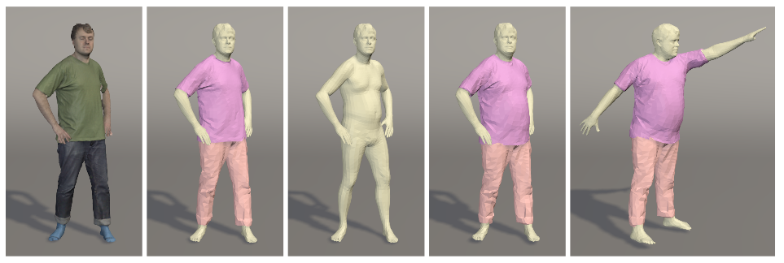
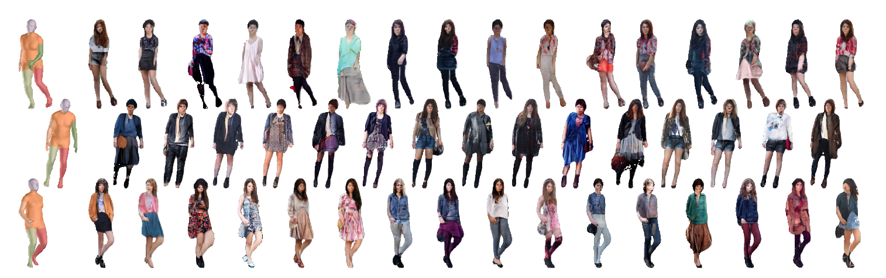
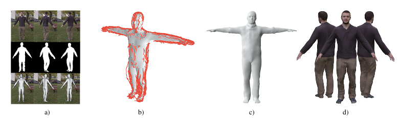
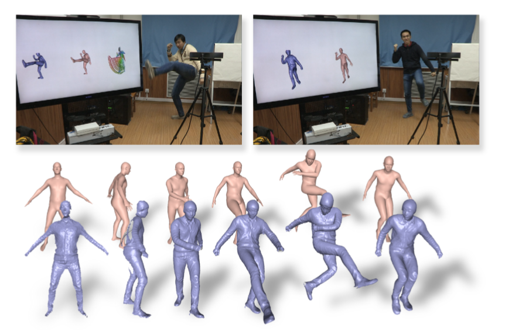
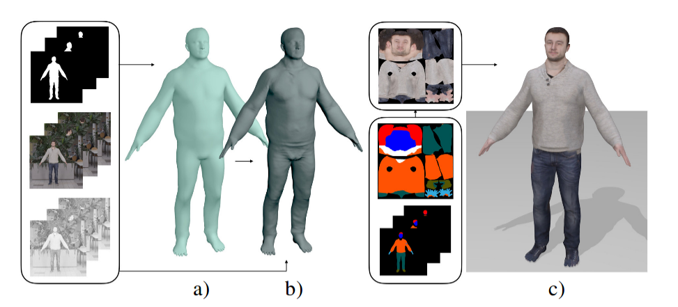
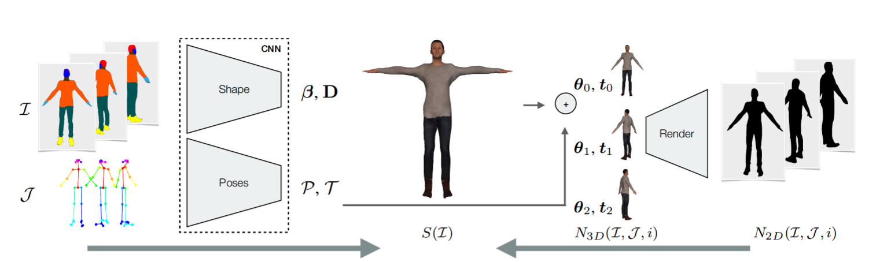
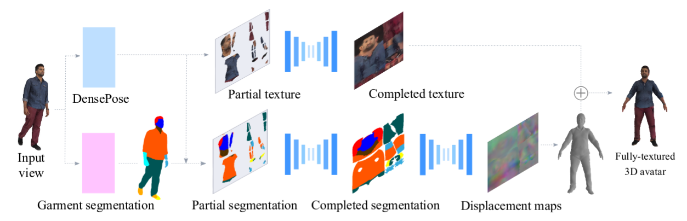
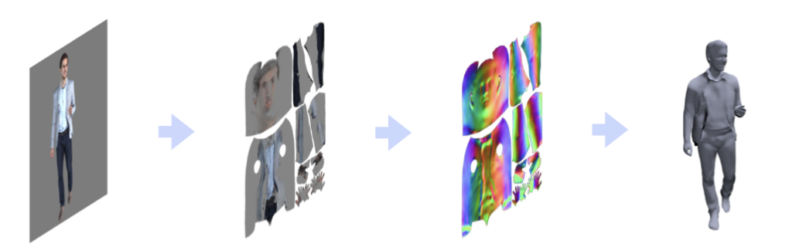
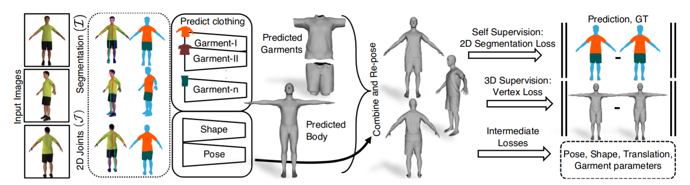

# Clothed People

## Gerard Pons-Moll

### [Siggraph, 2017] [ClothCap: Seamless 4D Clothing Capture and Retargeting](https://ps.is.tuebingen.mpg.de/publications/pons-moll-siggraph2017)  

> [论文解读](https://zhuanlan.zhihu.com/p/97712714)

**问题：** 如何对衣服进行捕捉

**输入：** 扫描获得的4D的有纹理的人体数据

**输出：** 多种衣服几何模型

### [ICCV, 2017] [A Generative Model of People in Clothing](http://files.is.tuebingen.mpg.de/classner/gp/)

**问题：** 如何生成多种衣服外观的人体图片

**输入：** 有姿势的SMPL模型，及其分割

**输出：** 不同衣着的对应姿势的图片

### [CVPR, 2018] [Video Based Reconstruction of 3D People Models](https://virtualhumans.mpi-inf.mpg.de/papers/alldieck2018video/alldieck2018videoshapes.pdf)

> [论文解读](https://zhuanlan.zhihu.com/p/97690143)

**问题：** 如何从RGB视频中获取细致的人体模型

**输入：** 单人的单目视频+轮廓

**输出：** 基于SMPL的细致的人体模型

### [CVPR, 2018] [DoubleFusion: Real-time Capture of Human Performance with Inner Body Shape from a Depth Sensor](https://virtualhumans.mpi-inf.mpg.de/papers/DoubleFusion2018/DoubleFusion2018.pdf)

**问题：** 如何从RGBD数据中实时获取细致的人体模型

**输入：** 单人的实时的RGBD数据流

**输出：** 基于SMPL的细致的人体模型

### [3DV, 2018] [Detailed Human Avatars from Monocular Video](https://virtualhumans.mpi-inf.mpg.de/papers/alldieck2018detailed/alldieck2018detailed.pdf)

**问题：** 如何从RGB视频中获取细致的人体模型

**输入：** 单人的单目视频+轮廓信息+语义分割

**输出：** 基于SMPL的更细致的人体模型

和之前的区别是，

- 增加shape-from-shading方法，
- 对SMPL模型进行了划分，增加其点的数量与面片的数量
- 贴纹理用了graph cut优化

### [CVPR, 2019] [SimulCap : Single-View Human Performance Capture with Cloth Simulation](https://virtualhumans.mpi-inf.mpg.de/papers/SimulCap19/SimulCap19.pdf)

**问题:** 对人体与衣服同时进行重建

**输入:** 实时的RGBD数据

**输出:** 人体模型与多层的衣服模型

**方法:**

1. 使用与DoubleFusion相同的方法先对人体进行重建，获得两层人体模型
2. 基于输入的图像信息对人体模型进行分割，获得多层衣服的模型
3. 分别对人体与衣服进行跟踪

### [CVPR, 2019] [Learning to Reconstruct People in Clothing from a Single RGB Camera](https://virtualhumans.mpi-inf.mpg.de/papers/alldieck19cvpr/alldieck19cvpr.pdf)

**问题:** 如何快速地从RGB相机的图像中去重建有衣服的人体

**输入:** 同一个人的几个视角下的图片

**输出:** SMPL+D的细致的人体形状,纹理是后处理贴的

**训练:** 使用合成数据训练, 渲染过程可微

[代码地址](https://github.com/thmoa/octopus)

### [3DV, 2019] [360-Degree Textures of People in Clothing from a Single Image]()

**问题:** 如何从单张图片中去获取有纹理的细致的人体模型

**输入:** 单张RGB图片

**输出:** 有纹理的三维人体模型-> texture map + displacement map

**训练:** 用之前扫描获得的人体数据生成UV map和displacement map

这篇用了几个下载人体模型的网站,需要用的时候可以看看

### [ICCV, 2019] [Tex2Shape: Detailed Full Human Body Geometry from a Single Image]()

**问题:** 如何从单张图片中去获取有纹理的细致的人体模型

**输入:** 单张RGB图片

**输出:** 细致的人体模型->输出normal map和displacement map

**训练:** 合成,渲染

文章最后还说了另一种思路的虚拟试衣功能的方法: 对于SMPL来说, 换装等价于保留其shape参数, 更换他的normal map和displacement map

### [ICCV, 2019] [Multi-Garment Net: Learning to Dress 3D People from Images](http://virtualhumans.mpi-inf.mpg.de/papers/bhatnagar2019mgn/bhatnagar2019mgn.pdf) [[code](https://github.com/bharat-b7/MultiGarmentNetwork)]

**问题:** 如何从单张图片中去获取有纹理的细致的人体模型

**输入:** 多个视角下的RGB图片->2D关键点与语义分割

**输出:** 在标准模型下的人体参数, 多片衣服参数

**训练:** 合成,渲染