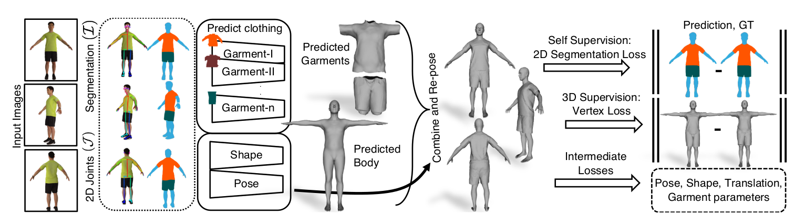

# [ICCV, 2019] [Multi-Garment Net: Learning to Dress 3D People from Images](http://virtualhumans.mpi-inf.mpg.de/papers/bhatnagar2019mgn/bhatnagar2019mgn.pdf) [[code](https://github.com/bharat-b7/MultiGarmentNetwork)]

> Dress SMPL body model with our Digital Wardrobe

论文提出了Multi-Garmetn Network(MGN)

- **问题：**从图片中获取一个人的衣服，并将他穿到另一个人身上
- **输入：**同一个人的一段视频中的少数帧（1-8帧）
- **输出：**使用SMPL表示的人体形状，以及附着在上面的衣服
- **数据：**搞了一个数字衣柜（digital wardobe)，包含了712个数字的garments。
- **难点:** 数据准备

- Stitching-Model fitting
- Eigenface
- Motion
- PCA

- face: 实时人脸识别, 记录ID

- ocr: 文字识别
- scene: 构建有十类场景的数据库,识别一张图片属于哪个场景
- segmentation: 场景分割
- stereo: 立体图像矫正和匹配 实现SAD, NCC, Graph Cuts, Belief Propagation
- stitching: 全景图像拼接, ORB特征, BA, 多频带融合消除接缝处差异, 有交互界面
- colorization: 输入黑白图片, 输出彩色图片