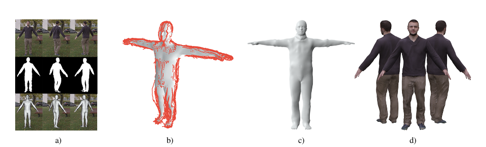
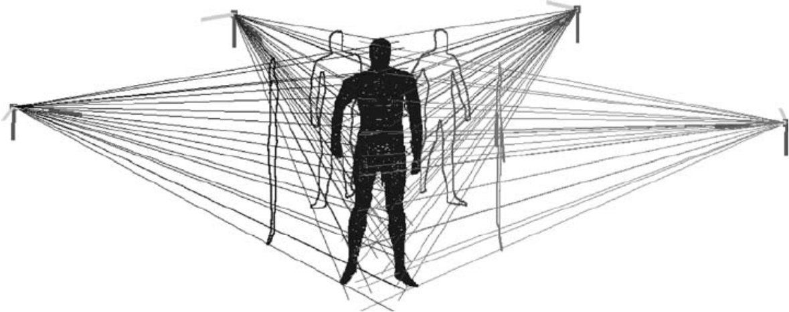

# 基于视频的3D人体模型重建

> 论文地址： [CVPR, 2018] [Video Based Reconstruction of 3D People Models](https://virtualhumans.mpi-inf.mpg.de/papers/alldieck2018video/alldieck2018videoshapes.pdf)
>
> [代码地址](https://github.com/thmoa/videoavatars)




- 输入：单目单人人体动的视频

- 输出：精确的人体形状及纹理

- 核心：将动态变化的每一帧转化到参考帧上，获得visual hull。

- 思想来源：visual hull 方法
  
  
  
  
  
  - 传统的visual hull ：从多视角的图片去估计一个静止的形状
  - 改造的visual hull：将各帧的人体动作undo到一个标准帧下。

- 步骤：
  1. 对每一帧拟合SMPL人体模型到2D关键点上
  2. 将轮廓上的点反投影到空间中，并逆变换到标准帧下
  3. 优化SMPL shape参数与每个点的位移，最小化点到线的距离

详细内容

1. 带偏置(offsets)的SMPL模型


2. **姿态估计**：增加拟合到轮廓的loss

   


其中

为SMPL模型渲染到图像上的轮廓；

为图片中得到的轮廓，

为其逆。w为权重。对这个loss优化四个不同分辨率的，提高鲁棒性。

   对于SMPLify文中的姿态的先验，这篇文章考虑的是人体是A-pose的，改成A-pose的先验。

   再考虑时序平滑。

3. **一致的形状**:使用上一步估计的pose，将每一帧的轮廓unpose到标准帧。

   - 数据项：
     


   - 拉普拉斯项：对mesh变形进行smooth
     


     其中的

为没有offset项的时候的拉普拉斯项

   - 身体模型项：约束offset的变形不要太大
   - 对称项：让身体处于对称位置的点的变形尽量一致

4. **纹理生成**: 把优化后的标准帧的模型重新投影到各个帧中，然后将图片反投影到纹理上。


## 附录：[知乎贴公式方案](https://zhuanlan.zhihu.com/p/69142198)

查找目标
```bash
\$\$\n*(.*?\n.*)\n\$\$
```
替换为
```html
\n\n
```

行内公式：
查找目标：
```html
\$\n*(.*?)\n*\$
```
替换为
```html
\n\n
```
